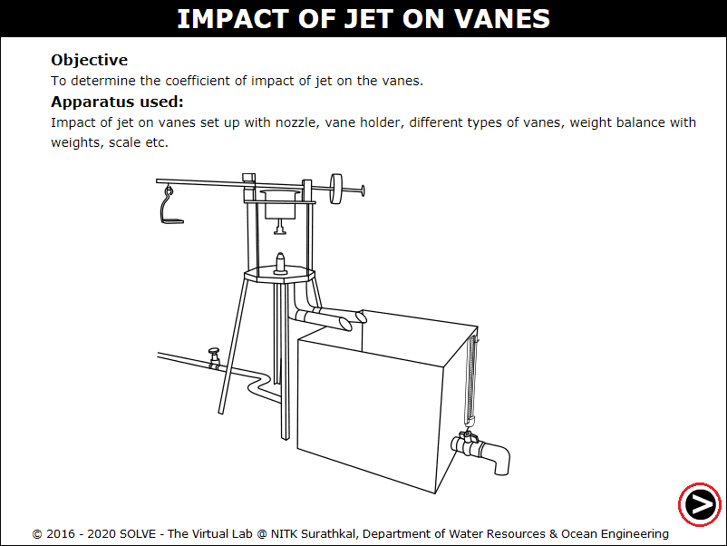
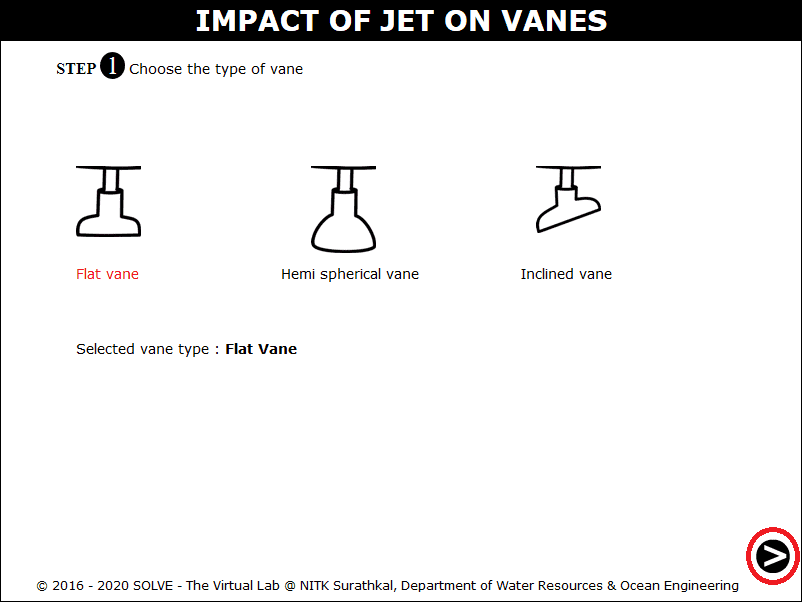
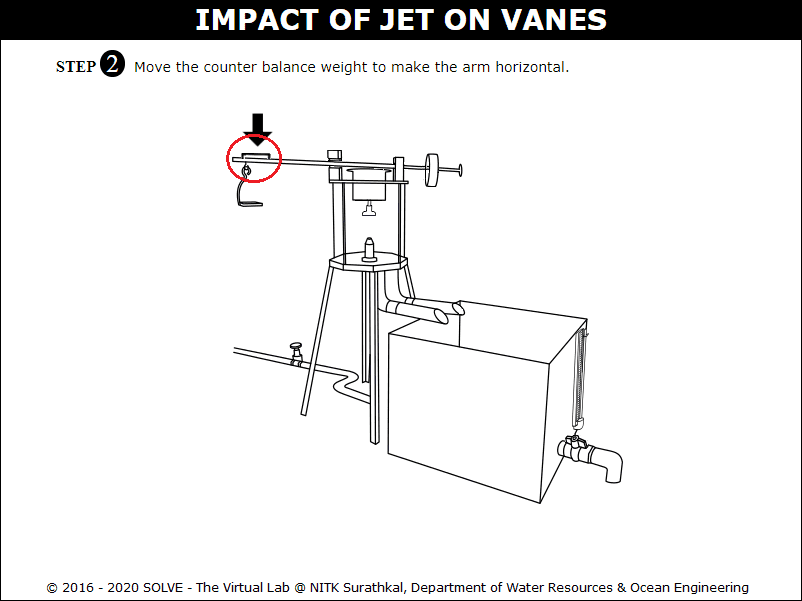
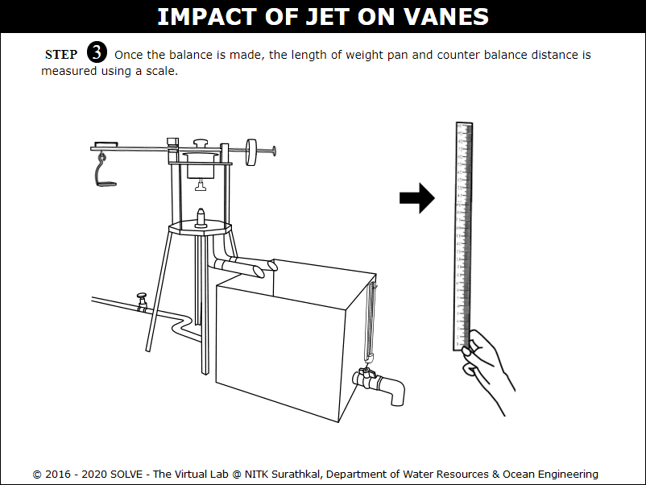
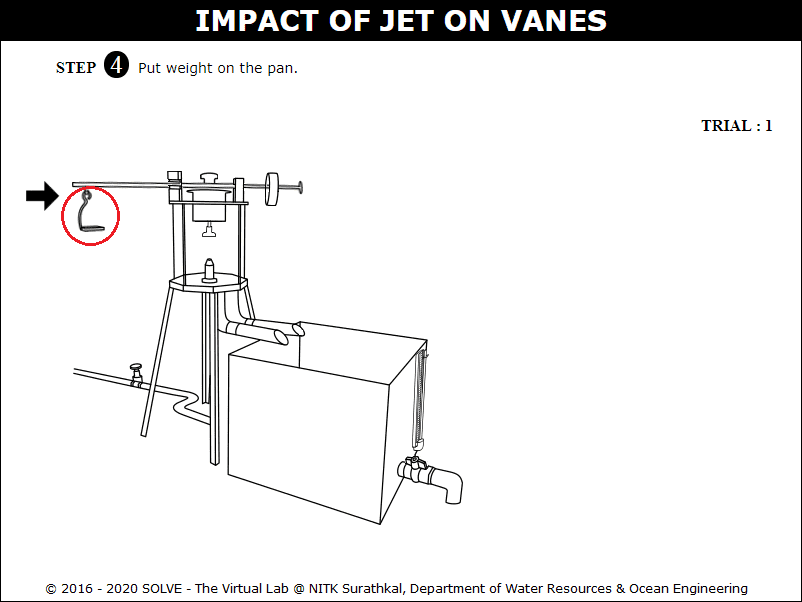
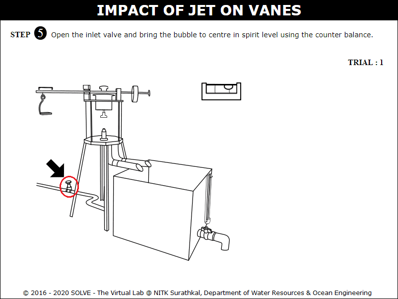
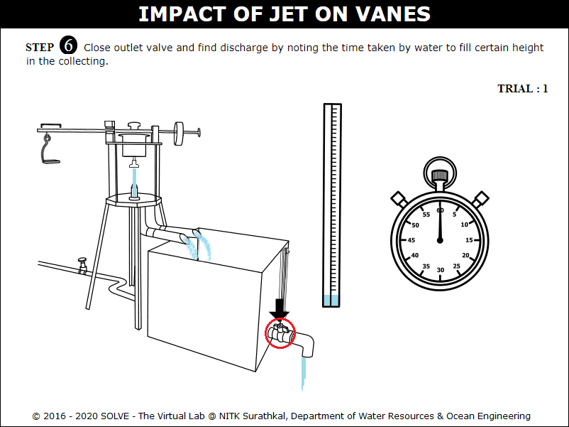
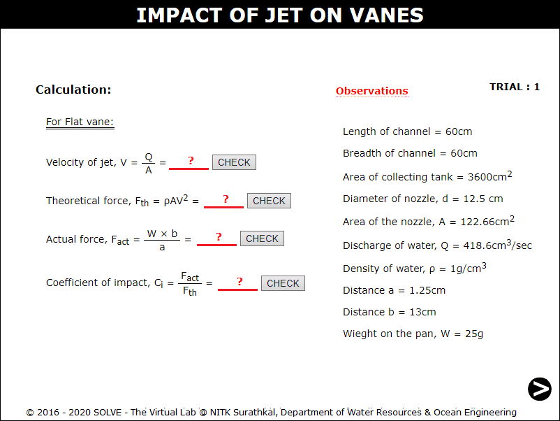
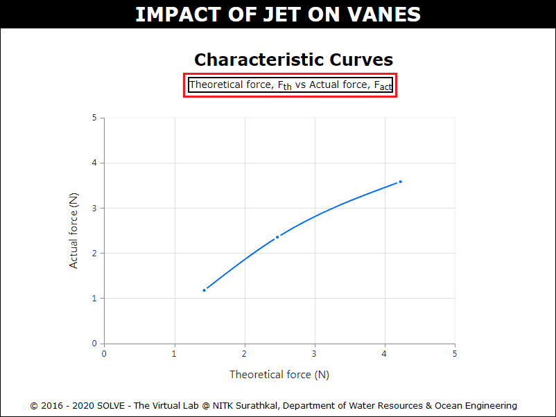

#### These procedure steps will be followed on the simulator
 
<ol>
<li>Open Impact of Jet on Vanes experiment, a window will appear as shown.</li> 

 

<li>Select the type of vanes to be used in the experiment, then click NEXT button</li> 

 

<li>Click on spirit level, and then click on counter balance to move it and make the arm horizontal.</li> 

 

<li>Here to measure the length of weighing pan and counter balance distance click on scale, then click NEXT button.</li> 

 

<li>Click on pan, the region will get zoomed, again click on weight to add it to the weighing pan.</li> 

 

<li>Now open the inlet valve and adjust the counter balance to make arm horizontal.</li> 

 

<li>Click on tank outlet valve to measure the discharge by closing the valve and record time taken for 5cm rise.</li> 

 

<li>The observation and calculation of the trial is given here. Now repeat the same procedure for other trials.</li> 

 

<li>Click on graph title to plot the graph. </li> 

 

</ol>
