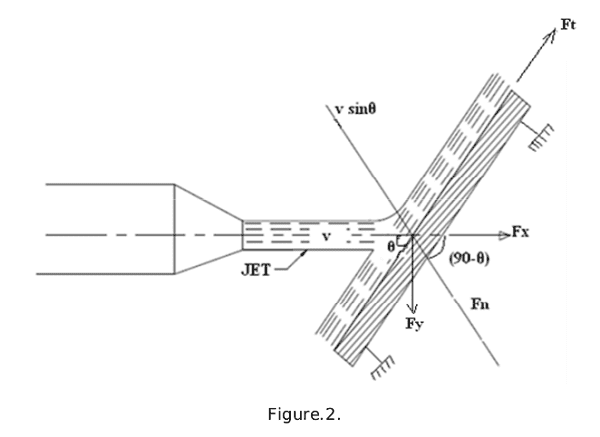
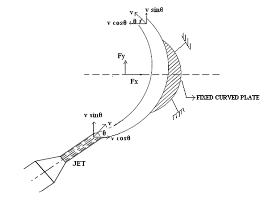

### INTRODUCTION 

The liquid comes out in the form of a jet from the outlet of a nozzle, which is fitted to a pipe through which the liquid if flowing under pressure. If some plate, which may be fixed or moving, is placed in the path of the jet, a force is exerted by the jet on the plate. This force is obtained from Newton’s second law of motion or from impulse-moment equation. Thus impact of jet means the force exerted by the jet on a plate which may be stationary or moving. In this chapter, the following cases of the impact jet i.e., the force exerted by the jet on a plate, will be considered:

<ol type="1">
	<li> Force exerted by a jet on a stationary plate when
		<ol type="a">
			<li>Plate is vertical to the jet, </li>
			<li> Plate is inclined to the jet, and</li>
			<li> Plate is curved.</li>
		</ol>
	</li> 
	<li>Force is exerted by the jet on the moving plate, when
		<ol type="a">
			<li> Plate is vertical to the jet,</li>
			<li>Plate is inclined to the jet, and </li>
			<li> Plate is curved</li>
		</ol>
	</li>
</ol>

### Force exerted by a jet on a stationary vertical plate :

Consider a jet of water coming out of the nozzle, strikes a flat vertical plate as shown in the Figure 1.

let,  
 
 

The jet after striking the plate will move along the plate. But the plate is right angles to the jet. Hence the jet after striking will get deflected by 90°. Hence the component of the velocity of the jet, in the direction of the jet, after striking will be zero. The force exerted by the jet on the plate in the direction of the jet.

= (initial momentum - final momentum)/ time
 
 
 
 
 

For deriving the above equation, we have taken initial velocity minus final velocity and not final
velocity minus initial velocity. If the force exerted on the jet is to be calculated then final minus the
initial velocity is taken. But if the force exerted by the jet on the plate is to calculated, then initial
velocity minus the final velocity is taken.

### Force exerted by a jet on a stationary inclined flat plate :

Let a jet of water, coming out from the nozzle; strike an inclined flat plate as shown in the figure.2.

  

Let

 
v = velocity of the  jet in the direction of X  
&#952; = Angle between the jet and the plate   
 

If the plate is assumed smooth and if it is assumed that there is no loss of energy due to the impact of
the jet, then the jet will move over the plate after striking with a velocity equal to initial velocity i.e.,
with a velocity V.

 Let find the force exerted by the jet on the plate In the direction normal to the plate. Let this force is represented by
Fn 

then, Fn = Mass of the jet striking per second × [initial velocity of the jet before striking in the direction
of n - final velocity of the jet after striking in the direction of n 
 

 

If the force can be resolved into two components, one in the direction of the jet and the other perpendicular to the direction
of the flow. Then we have,
 

 (along the direction of the flow) and

 
(perpendicular to flow)

### Force exerted by a jet on a stationary cover plate:

Jet strikes the curved plate at the centre. Let a jet of water strike a fixed curved plate at the
centre as shown in figure.3. The jet after striking the plate comes out with the same velocity if the plate is smooth and there is no loss of energy due to impact of the jet, in the tangential
direction of the curved plate. The velocity at the outlet of the plate can be resolved in to two components, one in the direction of the jet and the other perpendicular to the direction of the jet.

Component of velocity In the direction of the jet = 

(-ve sign is taken as the velocity at the outlet is in the opposite direction of the jet of water coming out from nozzle).

Component of the velocity perpendicular to the jet =  

Force exerted by the jet In the direction of the jet,

where,  

 

 v2 = final velocity in the direction of the jet= v cos &theta;
 

 
 

similarly 

where, 

 

-ve sign means the force is acting in the downward direction. In this case the angle of deflection of the jet = 

Jet strikes the curved plate at on e end tangentially when the plate is symmetrical Let the jet strike the curved plate at one end tangentially as shown in the figure.4. Let the curved is
symmetrical about x-axis. Then the angle made by the tangents at the two ends of the plate will be same.

Let V = Velocity of the jet of water

&theta; =angle made by jet with x-axis at inlet tip of the curved plate.

If the plate is smooth and loss of energy due to impact is zero, then the velocity of the water at the outlet tip of the curved plate will be equal to V. The force exerted by the jet of water in the direction of x and y are

 
 
 
 

 

Jet strikes the curved plate at one end tangentially when the plate is unsymmetrical When the curve plate is unsymmetrical about x axis, then the angles made by the tangents drawn at the inlet and outlet tips of the plate with x-axis will be different.

 &theta; = angle made by the tangent at the tip with the x – axis,
 

 

&phi; = angle made by the tangent at the outlet tip with x-axis.

The two component of the velocity at inlet are

The two component of the velocity at outlet are

 

&there4; The force exerted by the jet of water in the direction o x and y are

 
 
 
 
 

